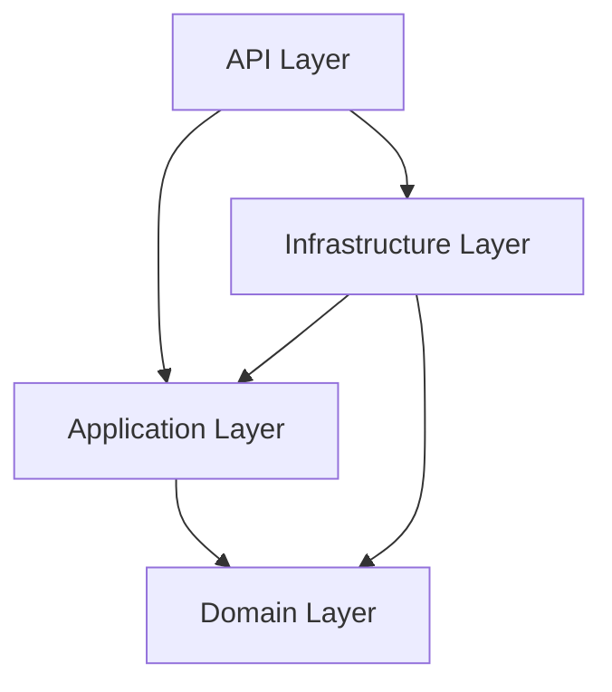
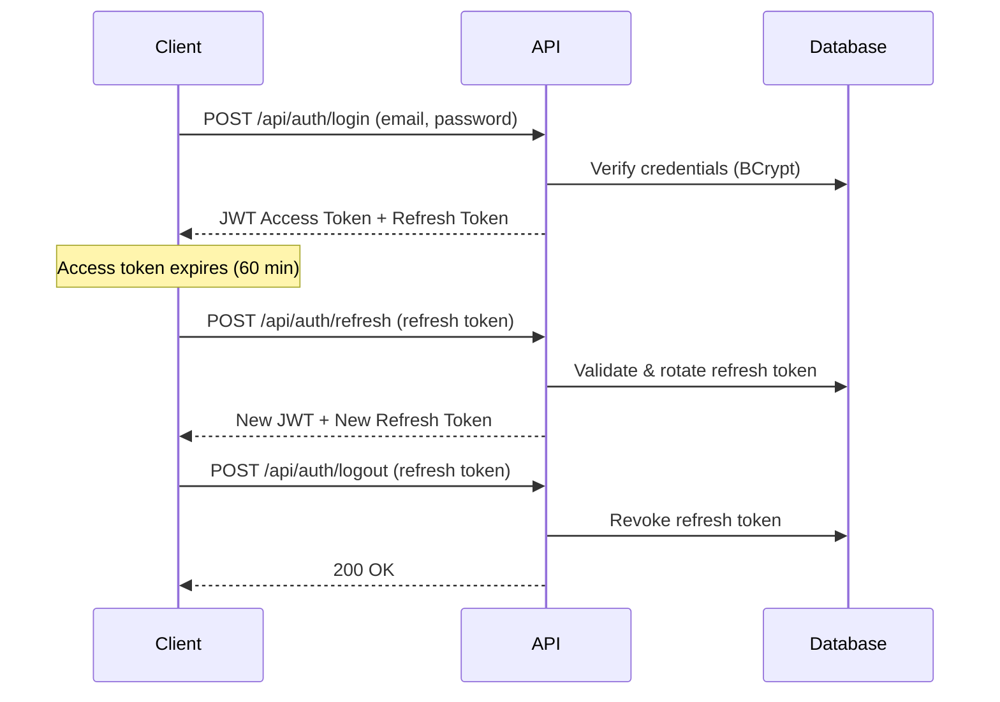

# 🛒 ECommerce System — Backend API

A full-featured E-Commerce REST API built with **ASP.NET Core (.NET 10)** following **Clean Architecture** principles. Designed to demonstrate enterprise-grade backend development with robust authentication, real-time notifications, advanced querying, and caching.

---

## ✨ Features

- **Clean Architecture** — Strict separation across Domain, Application, Infrastructure, and API layers
- **JWT Authentication** with Refresh Token Rotation and multi-device logout
- **Role-Based Access Control (RBAC)** — Admin, Seller, and Customer roles with policy-based authorization
- **Product Catalog** with filtering, sorting, and pagination
- **Server-Side Caching** using `IMemoryCache` with version-based invalidation
- **Real-Time Notifications** via SignalR for order status updates
- **FluentValidation** integrated through a custom action filter
- **Global Exception Handling** middleware returning RFC 7807 ProblemDetails
- **Entity Framework Core** with PostgreSQL, Fluent API configurations, and the Repository + Unit of Work patterns
- **AutoMapper** for clean entity-to-DTO transformations

---

## 🏗️ Architecture

```
ECommerceSystem/
├── ECommerceSystem.Domain          # Entities, Enums — zero dependencies
├── ECommerceSystem.Application     # Interfaces, DTOs, Validators, Mappings
├── ECommerceSystem.Infrastructure  # EF Core, Repositories, Services
└── ECommerceSystem.Api             # Controllers, Middleware, Hubs, Filters
```



> Dependencies flow inward — the Domain layer has no references to any other project.

---

## 🔧 Tech Stack

| Category | Technology |
|----------|-----------|
| **Framework** | ASP.NET Core 10 |
| **Language** | C# |
| **Database** | PostgreSQL |
| **ORM** | Entity Framework Core 10 |
| **Authentication** | JWT Bearer + Refresh Tokens |
| **Password Hashing** | BCrypt |
| **Real-Time** | SignalR |
| **Validation** | FluentValidation |
| **Object Mapping** | AutoMapper |
| **Caching** | IMemoryCache |
| **API Docs** | Swagger / OpenAPI |

---

## 📦 API Endpoints

### 🔐 Auth (`/api/auth`)

| Method | Endpoint | Auth | Description |
|--------|----------|------|-------------|
| `POST` | `/register` | Public | Register a new user |
| `POST` | `/login` | Public | Login and receive JWT + refresh token |
| `POST` | `/refresh` | Public | Refresh an expired access token |
| `POST` | `/logout` | 🔒 | Revoke a specific refresh token |
| `POST` | `/logout-all` | 🔒 | Revoke all refresh tokens for the user |

### 📦 Products (`/api/product`)

| Method | Endpoint | Auth | Description |
|--------|----------|------|-------------|
| `GET` | `/` | Public | Get all products (with filtering, sorting, pagination) |
| `GET` | `/{id}` | Public | Get product by ID |
| `POST` | `/` | Seller/Admin | Create a new product |
| `PUT` | `/{id}` | Seller/Admin | Update a product (owner only) |
| `DELETE` | `/{id}` | Seller/Admin | Delete a product (owner only) |

**Query Parameters** for `GET /api/product`:

| Parameter | Type | Description |
|-----------|------|-------------|
| `SearchTerm` | string | Search by name or description |
| `CategoryId` | int | Filter by category |
| `MinPrice` / `MaxPrice` | decimal | Filter by price range |
| `MinRating` | double | Filter by minimum average rating |
| `SortBy` | string | `price`, `rating`, or `popularity` |
| `IsDescending` | bool | Sort direction |
| `PageNumber` / `PageSize` | int | Pagination |

### 📂 Categories (`/api/category`)

| Method | Endpoint | Auth | Description |
|--------|----------|------|-------------|
| `GET` | `/` | Public | Get all categories |
| `GET` | `/{id}` | Public | Get category by ID |
| `POST` | `/` | Admin | Create category |
| `PUT` | `/{id}` | Admin | Update category |
| `DELETE` | `/{id}` | Admin | Delete category |

### 🛒 Cart (`/api/cart`)

| Method | Endpoint | Auth | Description |
|--------|----------|------|-------------|
| `GET` | `/` | 🔒 | Get current user's cart |
| `POST` | `/` | 🔒 | Add item to cart |
| `PUT` | `/{id}` | 🔒 | Update cart item quantity |
| `DELETE` | `/{id}` | 🔒 | Remove item from cart |
| `DELETE` | `/` | 🔒 | Clear entire cart |

### 📋 Orders (`/api/order`)

| Method | Endpoint | Auth | Description |
|--------|----------|------|-------------|
| `GET` | `/` | 🔒 | Get current user's orders |
| `GET` | `/all` | Admin | Get all orders |
| `GET` | `/{id}` | 🔒 | Get order by ID |
| `POST` | `/` | 🔒 | Place a new order |
| `PUT` | `/{id}/status` | Admin | Update order status (triggers real-time notification) |

### ⭐ Reviews (`/api/review`)

| Method | Endpoint | Auth | Description |
|--------|----------|------|-------------|
| `GET` | `/product/{productId}` | Public | Get reviews for a product |
| `GET` | `/{id}` | Public | Get review by ID |
| `POST` | `/` | 🔒 | Create a review |
| `PUT` | `/{id}` | 🔒 | Update a review (owner only) |
| `DELETE` | `/{id}` | 🔒 | Delete a review (owner only) |

### 👤 Users (`/api/user`)

| Method | Endpoint | Auth | Description |
|--------|----------|------|-------------|
| `GET` | `/` | Admin | Get all users |
| `GET` | `/{id}` | Admin | Get user by ID |
| `DELETE` | `/{id}` | Admin | Delete a user |

### 📡 SignalR Hub (`/orderHub`)

| Event | Direction | Description |
|-------|-----------|-------------|
| `OrderStatusUpdated` | Server → Client | Pushed when an admin updates an order's status |

> Clients connect with a JWT token and are automatically grouped by user ID.

---

## 🚀 Getting Started

### Prerequisites

- [.NET 10 SDK](https://dotnet.microsoft.com/download)
- [PostgreSQL](https://www.postgresql.org/download/)

### Setup

1. **Clone the repository**
   ```bash
   git clone https://github.com/YOUR_USERNAME/ECommerce-System.git
   cd ECommerce-System/ECommerceSystem
   ```

2. **Configure secrets**

   Use [User Secrets](https://learn.microsoft.com/en-us/aspnet/core/security/app-secrets) for local development:
   ```bash
   cd ECommerceSystem.Api
   dotnet user-secrets init
   dotnet user-secrets set "ConnectionStrings:DefaultConnection" "Host=localhost;Database=ECommerceDb;Username=postgres;Password=YOUR_PASSWORD;"
   dotnet user-secrets set "Jwt:SecretKey" "YOUR_SECRET_KEY_AT_LEAST_32_CHARACTERS_LONG"
   ```

3. **Apply migrations**
   ```bash
   dotnet ef database update --project ../ECommerceSystem.Infrastructure --startup-project .
   ```

4. **Run the API**
   ```bash
   dotnet run --project ECommerceSystem.Api
   ```

5. **Open Swagger UI**
   ```
   https://localhost:5001/swagger
   ```

---

## 🗂️ Project Structure

```
ECommerceSystem.Domain/
├── Entities/          # User, Product, Order, Category, CartItem, Review, etc.
└── Enums/             # UserRole, OrderStatus

ECommerceSystem.Application/
├── DTOs/              # Request/Response models per feature
├── Interfaces/        # IUnitOfWork, IRepository<T>, service interfaces
├── Mappings/          # AutoMapper MappingProfile
└── Validators/        # FluentValidation validators

ECommerceSystem.Infrastructure/
├── Configurations/    # EF Core Fluent API (IEntityTypeConfiguration<T>)
├── Data/              # ApplicationDbContext
├── Repositories/      # Generic Repository<T,TKey> + UnitOfWork
└── Services/          # AuthService, ProductService, OrderService, etc.

ECommerceSystem.Api/
├── Controllers/       # RESTful controllers with BaseApiController
├── Filters/           # ValidationFilter (FluentValidation integration)
├── Hubs/              # OrderHub (SignalR)
├── Middleware/         # ExceptionHandlingMiddleware
├── Services/          # OrderNotificationService
└── Program.cs         # DI, Auth, Swagger, middleware pipeline
```

---

## 🔐 Authentication Flow



---

## ⚙️ Design Patterns Used

| Pattern | Where |
|---------|-------|
| **Clean Architecture** | 4-layer project structure |
| **Repository Pattern** | Generic `Repository<T, TKey>` |
| **Unit of Work** | `UnitOfWork` with lazy-initialized repositories |
| **DTO Pattern** | Separate Request/Response models per feature |
| **Factory Method** | `AuthResponse.SuccessResponse()`, `.FailureResponse()` |
| **Middleware** | Global exception handling |
| **Action Filter** | FluentValidation integration |
| **Observer (SignalR)** | Real-time order notifications |

---

## 📄 License

This project is open source and available under the [MIT License](LICENSE).